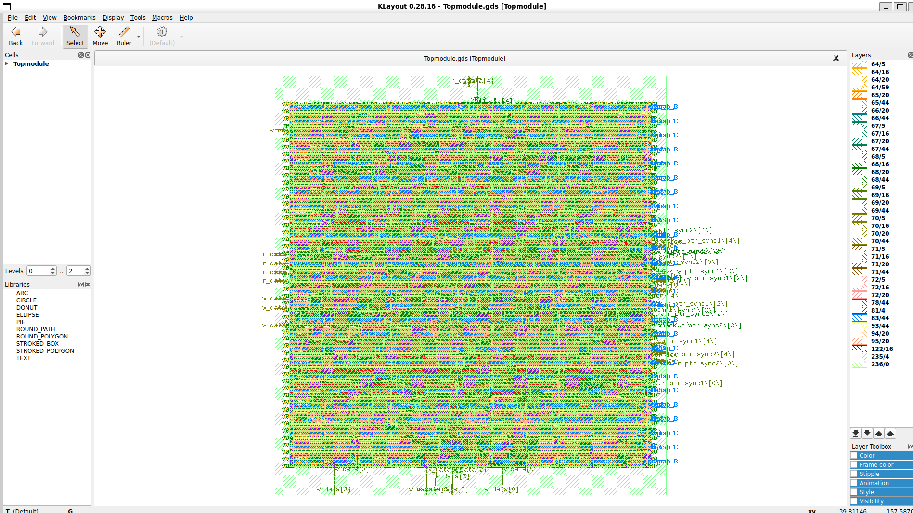
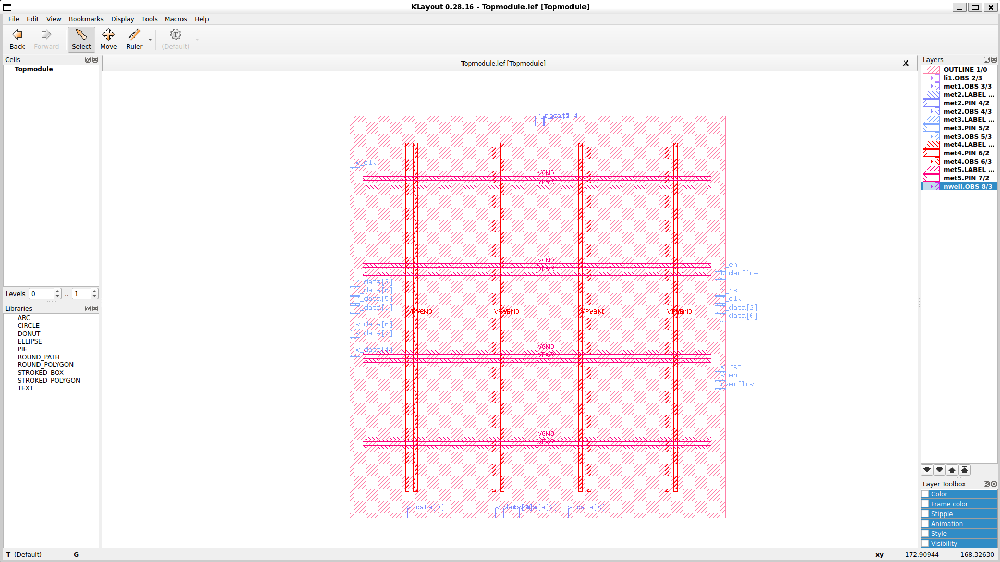

# Asynchronous FIFO RTL-to-GDSII using OpenLane (Sky130)

## Project Overview

This project demonstrates the complete RTL-to-GDSII implementation of an **Asynchronous FIFO** using the **OpenLane ASIC flow** and the **Sky130 PDK**. The design was synthesized, placed, routed, verified, and signed off using an open-source RTL-to-GDS flow.

---

## Project Features

- Verilog RTL Design
- Clock Domain Crossing (CDC)
- Gray Code Pointer Synchronization
- FIFO Full and Empty Detection
- Static Timing Analysis (STA)
- Physical Design using OpenLane
- Gate-Level Netlist Generation
- LEF and GDSII Generation
- DRC and LVS Verification

---

## Design Flow

```
RTL (Verilog)
      │
      ▼
Synthesis (Yosys)
      │
      ▼
Floorplanning
      │
      ▼
Power Distribution Network (PDN)
      │
      ▼
Placement
      │
      ▼
Clock Tree Synthesis (CTS)
      │
      ▼
Routing
      │
      ▼
Static Timing Analysis (STA)
      │
      ▼
DRC / LVS Verification
      │
      ▼
Final GDSII
```

---

## Tools Used

| Tool | Purpose |
|------|----------|
| OpenLane | RTL-to-GDSII Flow |
| OpenROAD | Floorplanning, Placement, CTS, Routing |
| Yosys | Logic Synthesis |
| Magic | Layout Generation & DRC |
| KLayout | GDSII Visualization |
| Netgen | LVS Verification |
| Sky130 PDK | Standard Cell Library |

---

## Reports Generated

- Synthesis Report
- Gate-Level Netlist
- Setup STA Report (Maximum Delay)
- Hold STA Report (Minimum Delay)
- Power Report
- LEF File
- Final GDSII Layout

---

## Repository Structure

```
├── src/
│   ├── Topmodule.v
│   ├── full.v
│   ├── empty.v
│
├── Testbench
│
├── Gate_Level_Netlist
│
├── STA_Max_Report
├── STA_Min_Report
├── Power_Report
│
├── Generated_LEF.png
├── Layout.png
├── Total_Report.png
│
└── README.md
```

---

## Results

### Final Physical Layout



---

### Generated LEF



---

### Gate-Level Netlist

- Successfully generated after synthesis.

---

### Static Timing Analysis

- ✔ Setup Timing Passed
- ✔ Hold Timing Passed
- ✔ No Setup Violations
- ✔ No Hold Violations

---

### Power Analysis

Power analysis was performed after place-and-route using OpenROAD/OpenLane signoff reports.

---

## Verification

- ✔ RTL Linting Passed
- ✔ Logic Synthesis Successful
- ✔ Placement Completed
- ✔ CTS Completed
- ✔ Routing Completed
- ✔ DRC Clean
- ✔ LVS Passed
- ✔ GDSII Generated Successfully

---

## Future Improvements

- Support configurable FIFO depth and width
- Multi-clock timing optimization
- Improve power and area efficiency
- Perform post-layout simulation using SDF

---


## License

This project is intended for educational and research purposes.
